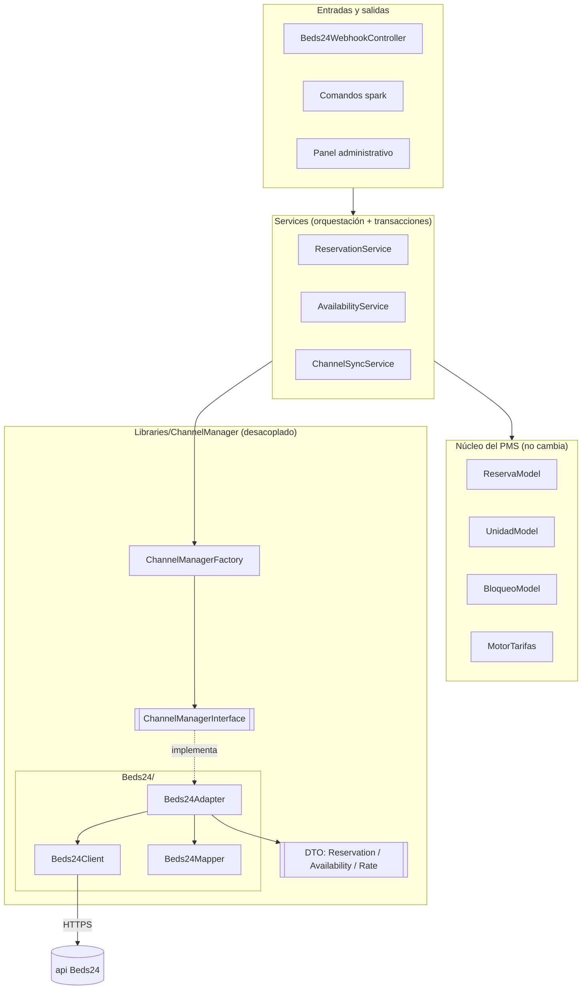
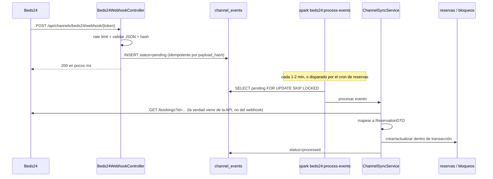
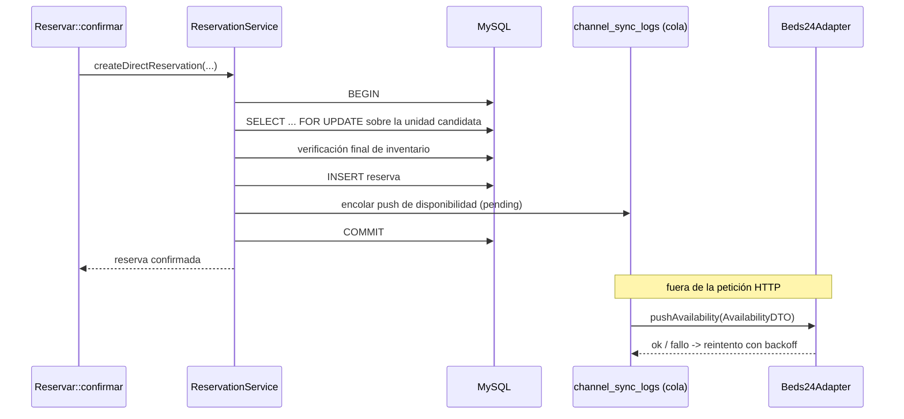

# ChannelManager · Etapa 1 · Arquitectura y decisiones

Integración del PMS de **San Antonio de los Lagos Ecolodge** (Cali, Colombia) con
**Beds24** como channel manager, sobre una capa desacoplada que después admita
SiteMinder, Cloudbeds o Lodgify sin tocar el núcleo.

Documento de diseño. **Todavía no hay código.** Aquí se fija qué se va a
construir, por qué, y qué falta por confirmar antes de empezar.

---

## 1 · Lo que ya hay en el sistema (respuestas verificadas, no supuestos)

Seis de las siete preguntas de partida se contestan mirando el código. Están
comprobadas contra la base de datos local, no deducidas.

| Pregunta | Respuesta verificada | Dónde se comprueba |
|---|---|---|
| Versión de CodeIgniter | **4.7.4**, PHP 8.2 local / **8.5.7** en producción | `composer.lock`, salida de `spark` |
| Nº de cabañas | **7 unidades**, todas de **un solo tipo** (`tipos_unidad` = 1 fila) | `select count(*) from unidades` |
| Tabla de reservas | `reservas(id, codigo, huesped_id, unidad_id, fecha_entrada, fecha_salida, adultos, ninos, estado, canal, comision, referencia_externa, total, notas)` — `estado` es ENUM `pendiente/confirmada/checkin/checkout/cancelada` | `2026-07-25-100000_CreateNucleoHotel.php` + `2026-08-04-090000_Canales.php` |
| Tabla de cabañas | `unidades(id, tipo_id, nombre, estado, orden, token_ical, …)`, `estado` ENUM `disponible/ocupada/limpieza/bloqueada` | misma migración |
| Cómo se calcula la disponibilidad | **No se almacena. Se deriva en cada consulta** de `reservas` (estados activos) + `bloqueos`, con la regla de que la noche de salida no ocupa | `ReservaModel::unidadDisponible()`, `ReservaModel::libresPorNoche()` |
| Canales que ya existen | Sincronización **iCal** con Booking y Airbnb: `canal_conexiones`, `bloqueos`, `spark canales:sincronizar`, exportación en `Canales::exportar/$token` | `2026-08-04-090000_Canales.php` |

Dos detalles del sistema actual que condicionan todo el diseño:

1. **Las tarifas se calculan por `tipo_unidad`, no por cabaña.** `MotorTarifas::cotizar()`
   recibe un `tipo_id`; `cotizarUnidad()` no hace más que resolver el tipo de esa
   cabaña y delegar. Hoy, **las 7 cabañas valen exactamente lo mismo**.
2. **`Reservar::confirmar()` no usa transacción ni bloqueo de filas.** Vuelve a
   comprobar disponibilidad justo antes de insertar, pero entre la comprobación
   y el `insert` no hay nada que impida que otra petición haga lo mismo. Con la
   web sola y 7 cabañas el riesgo es bajo; con OTAs conectadas deja de serlo.
   Ver riesgo **R1**.

### Lo que sí hay que preguntar

Solo tres cosas no están en el código y cambian el diseño. Van al final,
sección 12.

---

## 2 · Decisión de fondo: qué pasa con el iCal que ya funciona

Beds24 y el iCal actual hacen **lo mismo** para Booking y Airbnb: traer fechas
ocupadas. Si los dos quedan activos contra la misma OTA, cada reserva entra dos
veces — una como reserva real de Beds24 y otra como bloqueo iCal — y el
calendario enseña la cabaña ocupada por partida doble.

**Propuesta:**

- Beds24 pasa a ser el canal de las OTAs que gestione (Booking, Expedia,
  Hotels.com, Airbnb).
- Para esas OTAs se **desactiva** la conexión iCal (`canal_conexiones.activa = 0`).
  No se borra: queda como red de seguridad si un día hay que volver atrás.
- El iCal **se conserva** para lo que Beds24 no cubra: un calendario de Google
  de la familia, un portal local, bloqueos de obra.
- La exportación iCal propia (`Canales::exportar`) se mantiene tal cual: es
  salida, no entrada, y no colisiona.

Esto **no se automatiza**. Apagar un canal es una decisión de gerencia y se hace
a mano desde el panel, con un aviso claro cuando se detecte que una unidad tiene
a la vez conexión iCal activa y mapeo Beds24 para el mismo canal.

---

## 3 · Arquitectura

### Principio

El núcleo del PMS **no sabe que Beds24 existe**. Habla con una interfaz. La
implementación concreta se elige en tiempo de ejecución por configuración.



### Reglas que hacen que el desacoplo sea real

1. **Nada fuera de `Libraries/ChannelManager/Beds24/` menciona la palabra Beds24.**
   Ni los servicios, ni los modelos, ni el panel. Si mañana entra SiteMinder, se
   añade una carpeta hermana y se cambia una variable de `.env`.
2. **La frontera son los DTO.** Un `array` crudo de Beds24 no sale nunca del
   adaptador. Entra JSON, sale `ReservationDTO`.
3. **`Beds24Mapper` es puro y sin dependencias.** No toca base de datos ni red.
   Solo transforma estructuras. Por eso se puede probar sin mocks de nada.
4. **`Beds24Client` no sabe de reservas.** Solo sabe de HTTP, tokens, reintentos
   y límites de crédito. Devuelve arrays decodificados o lanza excepción.
5. **Los servicios son los dueños de las transacciones.** El adaptador nunca abre
   una transacción; no le corresponde.
6. **Los controladores no tienen lógica.** El webhook guarda el evento y contesta.
   Nada más.

### La factoría

```
ChannelManagerFactory::make(?string $provider = null): ChannelManagerInterface
```

Lee `CHANNEL_MANAGER_PROVIDER` de `.env` si no se le pasa nada. Registrada como
servicio de CI4 (`Config/Services.php`) para poder sustituirla por un doble en
las pruebas sin tocar el código de producción.

---

## 4 · Flujo de datos

### 4.1 Entrante · reserva nueva o modificada en una OTA

El webhook **no procesa nada**. Solo deja constancia. Y —decisión importante—
**no se fía del contenido del webhook**: lo usa como señal de «algo cambió en la
reserva X», y los datos buenos se piden después a la API con el token propio.



Si el webhook no llega —se cae, Beds24 lo reintenta mal, el servidor estaba
apagado— **el cron lo recoge igual** con `GET /bookings?modifiedFrom=...`. El
webhook es una optimización de latencia, no la fuente de verdad. El sistema
funciona sin él, solo con más retardo.

**Los doce pasos del flujo pedido, y dónde vive cada uno:**

| # | Paso | Dónde |
|---|---|---|
| 1 | Notificación o consulta programada | `Beds24WebhookController` / `SyncBeds24Reservations` |
| 2 | Registrar el evento completo | `ChannelEventModel::record()` |
| 3 | Calcular hash del contenido | `sha256` del JSON canónico, en el modelo |
| 4 | Validar que no se procesó antes | índice único `(channel, payload_hash)` |
| 5 | Buscar la equivalencia de unidad | `ChannelUnitMappingModel::resolveLocalUnit()` |
| 6 | Transformar a `ReservationDTO` | `Beds24Mapper::toReservationDTO()` |
| 7 | Crear o actualizar reserva local | `ReservationService::applyInbound()` **en transacción** |
| 8 | Bloquear disponibilidad | implícito: la reserva ya ocupa. Ver sección 6.2 |
| 9 | Registrar en `channel_reservations` | mismo servicio, misma transacción |
| 10 | Marcar `processed` | mismo servicio, misma transacción |
| 11 | Si falla: error + `attempts++` | `catch` fuera de la transacción |
| 12 | Repetible sin duplicar | garantizado por 4 + único `(channel, external_reservation_id)` |

### 4.2 Saliente · reserva creada en la web propia



Puntos que se respetan de forma explícita:

- **El envío a Beds24 va fuera de la transacción y fuera de la petición HTTP.**
  El huésped no espera a que responda un tercero.
- **Un fallo de Beds24 no revierte nunca la reserva local.** Queda encolada y se
  reintenta.
- **Si sigue fallando** pasado un umbral configurable, salta un aviso en el panel
  (el mismo mecanismo de la tarjeta de tareas de Administración).

---

## 5 · La API de Beds24 · lo verificado

Todo lo de esta sección está sacado de la especificación OpenAPI oficial
(`https://beds24.com/api/v2/apiV2.yaml`, `openapi: 3.0.0`, `title: API V2`)
descargada el 27-07-2026. **Nada aquí está inventado.** Lo que no se pudo
verificar está en la sección 10 marcado como `TODO_BEDS24_DOCUMENTATION`.

### 5.1 Autenticación

| | |
|---|---|
| **Esquema** | `apiKey` en cabecera, nombre exacto: **`token`** |
| **Cabecera opcional** | `organization` — *solo* si eres integration partner. Nosotros **no** la enviamos |
| **Alta inicial** | `GET /authentication/setup`, cabeceras `code` (obligatoria, el invite code) y `deviceName` (opcional) → devuelve `token`, `expiresIn`, `refreshToken` |
| **Renovación** | `GET /authentication/token`, cabecera `refreshToken` → devuelve un `token` nuevo |
| **Revocar** | `DELETE /authentication/token`, cabecera `refreshToken` |
| **Comprobar** | `GET /authentication/details` |
| **Invite code** | se genera en `https://beds24.com/control3.php?pagetype=apiv2` |
| **Scopes** | `bookings`, `bookings-personal`, `bookings-financial`, `inventory`, `properties`, `accounts`, `channels` |

> **Aviso literal de la documentación:** *«Refresh tokens do not expire so long as
> they have been used within the past 30 days»*. Un refresh token sin usar 30 días
> **muere**. Ver riesgo **R4**.

**Scopes que pediremos:** `bookings`, `bookings-personal`, `inventory`,
`properties`. **`bookings-financial` no**, salvo que haga falta traer importes
detallados: menos scope, menos daño si el token se filtra.

### 5.2 Endpoints que se van a usar

Antes de cada uno, lo que pediste: endpoint, método, autenticación, qué recibe,
qué devuelve, límites.

---

**a) Traer reservas**

1. **Endpoint:** `GET /bookings`
2. **Método:** GET
3. **Autenticación:** cabecera `token`
4. **Recibe (query):** `filter`, `propertyId`, `roomId`, `id`, `masterId`,
   `apiReference`, `channel`, `arrival`, `arrivalFrom`, `arrivalTo`, `departure`,
   `departureFrom`, `departureTo`, `bookingTimeFrom`, `bookingTimeTo`,
   **`modifiedFrom`**, **`modifiedTo`**, `searchString`, `includeInvoiceItems`,
   `includeInfoItems`, `includeGuests`, `includeBookingGroup`, `status`
5. **Devuelve:** `{success, type:"bookings", pages, data:[booking]}`.
   `status` ∈ `confirmed | request | new | cancelled | black | inquiry`
6. **Límites:** paginado (`page`); coste en créditos por petición

**Cómo se usa:** el polling incremental va por **`modifiedFrom`**, no por fecha
de llegada. Es la única forma de enterarse de una modificación o una cancelación
de una reserva antigua. **No existe `GET /bookings/{id}`**: para una sola
reserva se usa `GET /bookings?id=X`.

---

**b) Crear, modificar y cancelar reservas**

1. **Endpoint:** `POST /bookings`
2. **Método:** POST
3. **Autenticación:** cabecera `token`
4. **Recibe:** un **array** de objetos. Sin `id` = crear; con `id` = modificar.
   Campos del ejemplo oficial: `roomId`, `status`, `arrival`, `departure`,
   `numAdult`, `numChild`, `title`, `firstName`, `lastName`, `email`, `mobile`,
   `address`, `city`, `state`, `postcode`, `country`, `comment`, `infoItems[]`
5. **Devuelve:** `multiplePostResponse` — un resultado por elemento enviado
6. **Límites:** por lotes; conviene agrupar

**Cancelar** es `POST /bookings` con `[{"id": 7654321, "status": "cancelled"}]`.
Existe además `DELETE /bookings`, que **no usaremos**: la regla del proyecto es
no borrar nunca una reserva cancelada.

---

**c) Empujar disponibilidad, precios y restricciones**

1. **Endpoint:** `POST /inventory/rooms/calendar`
2. **Método:** POST
3. **Autenticación:** cabecera `token`
4. **Recibe:** array de `{roomId, calendar:[{from, to, numAvail, minStay, maxStay,
   multiplier, override, price1..price16, channels{...}}]}`.
   `override` ∈ `none | blackout | exception | noCheckIn | noCheckOut | noCheckInOrCheckOut`.
   `minStay` 1–365, `maxStay` 1–364, `multiplier` 0.1–100.
   **Poner un campo a `null` lo elimina.**
5. **Devuelve:** `multiplePostResponse`
6. **Límites:** créditos. Un solo POST admite **varias cabañas y rangos de fechas**,
   así que 365 días × 7 cabañas cabe en muy pocas peticiones si se agrupan bien

**Consecuencias de diseño, importantes:**

- **No existe «cierre de llegada» y «cierre de salida» como campos separados.**
  Beds24 lo mete todo en **un solo campo** `override`, que además comparte sitio
  con `blackout`. **No se puede tener a la vez blackout y noCheckIn.** El
  `RateDTO` lo modelará como dos booleanos por comodidad y el *mapper* los
  colapsará a `override`, con precedencia explícita y documentada.
- **No existe un identificador de plan tarifario.** Beds24 tiene **16 huecos de
  precio por cabaña** (`price1`…`price16`). Nuestro `external_rate_plan_id`
  guardará el **número de hueco** (`"1"`…`"16"`), no un id.
- **La moneda no viaja en el calendario.** Es un ajuste de la *property*. El COP
  se configura una vez en Beds24; `RateDTO::currency` sirve para **validar** que
  no estamos mandando pesos a una propiedad configurada en dólares, no para
  enviar.
- **`numAvail` puede venir negativo** si la cabaña está sobrevendida. Hay que
  tratarlo, no asumir ≥ 0.

---

**d) Leer disponibilidad (para conciliar)**

1. **Endpoint:** `GET /inventory/rooms/availability`
2. **Método:** GET
3. **Autenticación:** cabecera `token`
4. **Recibe:** `roomId[]`, `propertyId[]`, `startDate`, `endDate`
   (*«The last night to be booked, i.e. the day before check-out»* — ojo, es la
   última **noche**, no la fecha de salida)
5. **Devuelve:** `[{roomId, propertyId, name, availability:{"2021-01-01": true, …}}]`
6. **Límites:** paginado + créditos

---

**e) Descubrir el mapeo de cabañas**

`GET /properties` y `GET /properties/rooms` → para la pantalla de mapeo del
panel, que ofrecerá una lista desplegable en vez de obligar a escribir ids a mano.

---

**f) Leer el calendario (conciliación de precios y restricciones)**

`GET /inventory/rooms/calendar` con `startDate` y `endDate` **obligatorios** y al
menos un `includeX` (`includeNumAvail`, `includeMinStay`, `includePrices`, …).
Sin ningún `includeX` **devuelve vacío** — es un error fácil de cometer.

### 5.3 Límites de uso

Crédito **por cuenta**, en ventana móvil de **5 minutos**. Los sub-cuentas tienen
crédito propio; los tokens de la misma cuenta lo comparten.

Cabeceras según el OpenAPI oficial:

```
X-FiveMinCreditLimit
X-FiveMinCreditLimit-ResetsIn
X-FiveMinCreditLimit-Remaining
X-RequestCost
```

> **Discrepancia detectada.** El wiki de Beds24 documenta estas mismas cabeceras
> con otro nombre: `x-five-min-limit-remaining`, `x-five-min-limit-resets-in`,
> `x-request-cost`. No he podido comprobar cuál manda una respuesta real porque
> no tenemos credenciales todavía. **`Beds24Client` leerá las dos grafías**, sin
> distinguir mayúsculas, y registrará cuál encontró la primera vez. Un detalle
> tonto que, mal resuelto, deja el control de créditos ciego.

---

## 6 · Modelo de datos

### 6.1 Las cinco tablas pedidas

Se crean las cinco, con los campos mínimos que pediste. Ajustes:

**`channel_properties`**
- Único `(channel, local_property_id)` — como pediste.
- Además único `(channel, external_property_id)`: una property de Beds24 no puede
  estar mapeada a dos propiedades locales. Hoy solo hay una, pero el índice cuesta
  nada y evita un error de dedo irreparable.
- `credentials_encrypted TEXT NULL` — ver sección 9.

**`channel_unit_mappings`**
- Único `(channel, local_unit_id)`: una cabaña, un mapeo por canal.
- Único `(channel, external_unit_id)`: y al revés. **Los dos hacen falta.** Con
  uno solo, dos cabañas locales pueden apuntar al mismo room de Beds24 y las
  reservas entran en la cabaña equivocada de forma silenciosa.
- `external_rate_plan_id VARCHAR(20)` guarda el **número de hueco de precio**
  (ver 5.2c).

**`channel_reservations`**
- Único `(channel, external_reservation_id)` — como pediste. Es la pieza que
  hace idempotente todo el flujo entrante.
- `raw_payload JSON` **separado** de los campos operativos: los datos personales
  del huésped viven en `huespedes`, aquí queda la copia original para trazabilidad
  y se purga a los N meses (ver 9).
- `local_reservation_id` **nullable**: hay un instante entre registrar la reserva
  externa y crear la local, y hay casos —unidad sin mapear— en los que nunca
  llega a existir.

**`channel_events`**
- `payload_hash CHAR(64)` con único `(channel, payload_hash)`. **Esa es la
  idempotencia real.** El `external_event_id` no vale: no está confirmado que
  Beds24 lo mande (ver sección 10).
- `status` ENUM `pending/processing/processed/failed/ignored`, con índice
  `(status, attempts)` para que el reintento no haga full scan.
- `received_at` separado de `created_at`: si el evento se recupera de un log
  atrasado, no es lo mismo cuándo pasó que cuándo lo guardamos.

**`channel_sync_logs`**
- Es a la vez **bitácora y cola de salida**. Un registro `direction=outbound`
  con `status=pending` es un envío que falta por hacer. Evita inventar una tabla
  de cola aparte que diría casi lo mismo.
- Índice `(status, direction, attempts)`.
- `request_payload` / `response_payload` pasan por un **filtro que quita tokens**
  antes de guardarse.

### 6.2 Desviación importante: la tabla de disponibilidad

**Pediste** una disponibilidad local por cabaña / fecha / cantidad, con bloqueos,
reservas, mantenimiento y cierre de ventas.

**Recomiendo no crearla.** Motivo:

Hoy la disponibilidad **se deriva** de `reservas` + `bloqueos` en el momento de
consultarla (`ReservaModel::libresPorNoche()`). Si añadimos una tabla
`disponibilidad(unidad, fecha, cantidad)` pasamos a tener **dos fuentes de verdad
para el mismo hecho**. Y en cuanto hay dos, se separan: un `UPDATE` directo en
`reservas`, un rollback a medias, una migración… y a partir de ahí el calendario
público y el calendario real dicen cosas distintas. Ese fallo no da error: vende
una noche vendida.

Con 7 cabañas, derivar cuesta una consulta y un bucle en memoria. Ya está escrito
y probado.

**Lo que sí hace falta**, y es lo que se construye:

1. **Una proyección de solo lectura**, `AvailabilityService::snapshot(desde, hasta)`,
   que devuelve el mismo cálculo en forma de `AvailabilityDTO[]` listos para
   empujar. Sin tabla: se calcula y se manda.
2. **Una cola de salida** (`channel_sync_logs` con `direction=outbound`) que
   recuerda **qué rangos hay que reenviar**, no cuál es la disponibilidad.
3. **Ampliar `bloqueos`** con un campo `motivo` (`obra`, `mantenimiento`,
   `uso_propio`, `cierre_ventas`, `ical`) para cubrir los casos que pedías —
   mantenimiento y cierre de ventas — **sin duplicar el modelo**.

Si prefieres la tabla materializada de todas formas, se hace; pero entonces hay
que añadir un proceso de recálculo y una comprobación nocturna de que coincide
con lo derivado, y eso es más código y más cosas que se rompen. **Mi
recomendación es la proyección.**

### 6.3 Reservas pendientes con vencimiento

Pediste que la disponibilidad contemple «reservas pendientes con vencimiento».
Hoy `reservas.estado = 'pendiente'` **ocupa indefinidamente**: está en
`ESTADOS_ACTIVOS` y no caduca nunca. Hace falta:

- `reservas.expira_en DATETIME NULL`
- un comando que pase a `cancelada` (motivo `caducada`) las pendientes vencidas
- y que, al hacerlo, **libere la disponibilidad y lo empuje a Beds24**

Va en la Etapa 4, con la cola de salida ya montada.

### 6.4 Mapeo de estados

Configurable en `Config/ChannelManager.php`, no incrustado en el código:

| Beds24 | Interno propuesto | Nota |
|---|---|---|
| `new` | `pending` | recién llegada, aún sin confirmar |
| `request` | `pending` | petición pendiente de aceptar |
| `inquiry` | `ignored` | **no ocupa**. Es una consulta, no una reserva |
| `confirmed` | `confirmed` | |
| `cancelled` | `cancelled` | nunca se borra |
| `black` | `blocked` | bloqueo, no reserva → va a `bloqueos`, no a `reservas` |

Dos observaciones:

- **`black` no es una reserva.** Mapearlo a `reservas` metería reservas fantasma
  sin huésped. Va a la tabla `bloqueos`, que existe justo para eso.
- Los estados internos que pediste (`modified`, `no_show`, `completed`) **no caben
  en el ENUM actual** de `reservas`, que es `pendiente/confirmada/checkin/checkout/cancelada`.
  Propuesta: **no ampliar el ENUM**. `modified` no es un estado, es un evento (ya
  queda en `channel_events`); `completed` ya es `checkout`. El único que falta de
  verdad es **`no_show`**, y ese sí se añade al ENUM en una migración.

---

## 7 · Decisiones técnicas

**D1 · El webhook no se cree lo que le llega.** Registra el evento y dispara una
relectura contra la API. Elimina de un plumazo el problema de la suplantación
(sección 10: no está confirmado que Beds24 firme los webhooks) y el de los
eventos desordenados: la API siempre da el estado actual, un webhook da un estado
del pasado.

**D2 · Polling por `modifiedFrom` con ventana solapada.** El cursor se guarda,
pero cada consulta retrocede un margen configurable (por defecto 2× el intervalo,
mínimo 15 min). Cuesta unos créditos de más y protege de dos cosas: el desfase de
reloj y la zona horaria de `modifiedTime`, que no está documentada (sección 10).
La idempotencia hace que reprocesar sea inofensivo.

**D3 · La cola de salida vive en `channel_sync_logs`.** Una tabla menos, y la
trazabilidad y la cola son la misma información vista de dos maneras.

**D4 · Backoff exponencial con *jitter*.** 1s, 2s, 4s, 8s… más un aleatorio. Sin
el aleatorio, siete reintentos que fallaron a la vez vuelven a fallar a la vez.
En un **429**, se respeta `X-FiveMinCreditLimit-ResetsIn` si viene; el backoff es
el plan B.

**D5 · Un `correlationId` por operación** (ULID), en todos los registros de
`channel_sync_logs` y en el log de la aplicación. Sin él, reconstruir qué pasó
con una reserva concreta a las 3 de la mañana es imposible.

**D6 · `SELECT … FOR UPDATE` sobre la fila de `unidades`**, no sobre `reservas`.
Bloquear filas de reservas no impide que se **inserte** una nueva; bloquear la
cabaña sí serializa a los dos candidatos. Es lo que arregla **R1**.

**D7 · Un solo `POST /inventory/rooms/calendar` por sincronización**, agrupando
las 7 cabañas y comprimiendo los días de igual valor en rangos `from`/`to`. Un
día por petición serían 2.555 llamadas para un año.

**D8 · La conciliación no corrige nada por su cuenta.** Genera un informe. Solo
se autocorrige lo que tenga una regla explícita y sin ambigüedad (por ejemplo:
reserva cancelada en Beds24 y activa aquí → cancelar aquí). Importes, fechas y
cambios de cabaña se reportan para que decida una persona.

**D9 · `strict_types=1`, PSR-12, todo tipado.** Clases y métodos en inglés,
mensajes de interfaz en español, comentarios en español explicando el **porqué**.

**D10 · Todas las fechas se manejan como `Y-m-d` en `America/Bogota`.**
`DateTimeImmutable`, nunca `DateTime` mutable, nunca `strtotime` suelto en la capa
de dominio.

---

## 8 · Riesgos, por gravedad

**R1 · Sobreventa por falta de transacción — el más grave, y ya existe.**
`Reservar::confirmar()` comprueba disponibilidad y después inserta, sin bloqueo.
Dos peticiones simultáneas para la última cabaña pasan las dos. Hoy es
improbable; con Booking y Airbnb empujando reservas a la vez, deja de serlo.
*Mitigación:* `ReservationService` con transacción + `FOR UPDATE` sobre la unidad
+ verificación final dentro de la transacción. **Esto se arregla en la Etapa 3,
antes de conectar ninguna OTA.**

**R2 · Doble bloqueo iCal + Beds24.** Ver sección 2.
*Mitigación:* apagado manual de las conexiones iCal solapadas + detección
automática que avisa en el panel.

**R3 · Las 7 cabañas comparten un solo tipo y un solo precio.** Si en Beds24 se
crean como 7 rooms independientes, hay que empujar el mismo precio 7 veces y
mantenerlos sincronizados. Si se crean como 1 room con `numAvail: 7`, el reparto
de qué cabaña concreta le toca a cada huésped lo hace nuestro sistema — que es
donde debe hacerse. *Depende de la pregunta P2.*

**R4 · Muerte del refresh token a los 30 días.** Documentado por Beds24. Si el
alojamiento pasa un mes tranquilo, o el cron se para en temporada baja, el token
caduca y **la sincronización se apaga en silencio**.
*Mitigación:* `GET /authentication/details` en cada ejecución de conciliación,
aviso en el panel si faltan menos de 7 días de margen, y la tarjeta de tareas de
Administración marcando «Requiere atención».

**R5 · Zona horaria de `modifiedTime`.** No documentada. Si asumimos Bogotá y es
UTC, se pierden reservas de las últimas 5 horas en cada barrido.
*Mitigación:* D2 (ventana solapada) + comprobación empírica en cuanto haya
credenciales.

**R6 · Crédito de la API agotado.** El coste va por créditos, no por peticiones,
y no sabemos el coste de cada llamada hasta medirlo.
*Mitigación:* el cliente lee el crédito restante y **frena solo** por debajo de un
umbral, dejando margen para lo urgente (reservas) frente a lo aplazable
(sincronización de precios de dentro de 8 meses).

**R7 · Datos personales de huéspedes en `raw_payload`.** Ley 1581/2012.
*Mitigación:* sección 9.

**R8 · Diferencia de nombres de las cabeceras de crédito.** Ver 5.3.
*Mitigación:* leer ambas grafías.

**R9 · Nadie ha probado esto con una reserva real.** El sistema tiene 5 reservas
de prueba, 0 reservas de OTA y 0 facturas Siigo emitidas.
*Mitigación:* la Etapa 5 incluye un plan de puesta en marcha con **una sola
cabaña mapeada** durante las primeras semanas. Si algo va mal, afecta a una
séptima parte del inventario.

---

## 9 · Seguridad

- **Nada de credenciales en el código ni en git.** Todo en `.env`.
- **El `refreshToken` se guarda cifrado en base de datos** con `encrypter` de CI4
  y `encryption.key` en `.env`. Se guarda porque hay que rotarlo y hay que poder
  revocarlo; no se muestra nunca en el panel, ni entero ni parcial.
- **El `token` de acceso vive en caché** (`expiresIn` menos un margen), nunca en
  base de datos.
- **La URL del webhook lleva un token largo aleatorio** (`/api/channels/beds24/webhook/{token}`),
  comparado con `hash_equals()`. Es lo que sustituye a la firma mientras no se
  confirme que existe.
- **CSRF desactivado solo en la ruta del webhook**, que es una API máquina a
  máquina. En ninguna otra.
- **Rate limiting** en el webhook con el `throttler` de CI4, por IP.
- **Se registra IP y las cabeceras relevantes**, nunca la cabecera de
  autenticación ni el token de la URL.
- **Los payloads pasan por un depurador** que sustituye por `***` cualquier campo
  cuyo nombre contenga `token`, `secret`, `key`, `password`, `card`, `cvv`.
- **Nunca se almacena CVV ni número de tarjeta.** Si Beds24 los incluye en el
  payload de una reserva —Booking a veces manda tarjeta virtual— se **eliminan
  antes de guardar** `raw_payload`.
- **`raw_payload` se purga** a los 12 meses por un comando programado.
- **El panel del módulo está bajo `rol:gerencia`**, igual que Administración.

---

## 10 · Lo que falta por confirmar de Beds24 · `TODO_BEDS24_DOCUMENTATION`

Estas cosas **no** están en la especificación OpenAPI oficial. No las voy a
inventar: van como constantes marcadas y se confirman en cuanto haya cuenta.

| Marcador | Qué falta | Cómo se sortea mientras tanto |
|---|---|---|
| `TODO_BEDS24_DOCUMENTATION::WEBHOOK_PAYLOAD` | El OpenAPI declara la etiqueta `Webhooks` pero **no define ninguna ruta ni ningún esquema de webhook**. No sé qué campos manda | D1: el payload solo se usa para sacar el id de reserva; los datos se releen de la API |
| `TODO_BEDS24_DOCUMENTATION::WEBHOOK_SIGNATURE` | No consta que exista firma ni cabecera de autenticidad | Token largo en la URL + rate limit + relectura contra la API |
| `TODO_BEDS24_DOCUMENTATION::WEBHOOK_EVENT_ID` | No consta un identificador de evento | La idempotencia se apoya en `payload_hash`, no en un id externo |
| `TODO_BEDS24_DOCUMENTATION::WEBHOOK_SETUP` | Los webhooks se configuran en el panel de Beds24, no por API. Falta saber qué eventos ofrece | Se documenta a mano en el README de la Etapa 5 |
| `TODO_BEDS24_DOCUMENTATION::TIMEZONE` | Zona horaria de `bookingTime` y `modifiedTime` | Ventana solapada (D2) |
| `TODO_BEDS24_DOCUMENTATION::CREDIT_HEADERS` | Dos grafías distintas entre OpenAPI y wiki | Leer ambas |
| `TODO_BEDS24_DOCUMENTATION::CREDIT_COST` | Cuántos créditos cuesta cada llamada y cuál es el límite del plan | Se mide en la primera ejecución real y se ajusta |
| `TODO_BEDS24_DOCUMENTATION::BASE_URL` | El OpenAPI dice `servers: [{url: /v2}]` (relativo). La documentación usa `https://beds24.com/api/v2`. `https://api.beds24.com/v2` también responde | Se usa la de la documentación y se deja en `.env` |
| `TODO_BEDS24_DOCUMENTATION::MIN_GUESTS` | Pediste «nº mínimo de huéspedes». No aparece en el calendario; parece ajuste de room o de price rule | Se deja en el DTO y sin enviar hasta confirmarlo |

---

## 11 · Variables de entorno propuestas

```ini
# ── Channel manager ──────────────────────────────────────────
CHANNEL_MANAGER_PROVIDER = beds24
CHANNEL_MANAGER_ENABLED  = false        # interruptor maestro

# ── Beds24 ───────────────────────────────────────────────────
BEDS24_BASE_URL       = https://beds24.com/api/v2
BEDS24_REFRESH_TOKEN  =                 # solo el primer arranque; después va cifrado en BD
BEDS24_PROPERTY_ID    =
BEDS24_WEBHOOK_TOKEN  =                 # el segmento secreto de la URL del webhook
BEDS24_TIMEOUT        = 30
BEDS24_CONNECT_TIMEOUT= 10
BEDS24_MAX_RETRIES    = 3
BEDS24_CREDIT_FLOOR   = 50              # por debajo de esto, solo lo urgente

# ── Ritmo de sincronización (todo configurable) ──────────────
BEDS24_SYNC_DAYS                = 365
BEDS24_RESERVATION_SYNC_MINUTES = 5
BEDS24_LOOKBACK_MINUTES         = 15    # solape de la ventana modifiedFrom
BEDS24_RETRY_MINUTES            = 10
BEDS24_FAILURE_ALERT_ATTEMPTS   = 5
BEDS24_RAW_PAYLOAD_TTL_DAYS     = 365
```

`BEDS24_API_KEY` **no aparece**: la API v2 no usa api key, usa `token` derivado
del `refreshToken`. Ponerla sería arrastrar un concepto de la v1, que está
obsoleta.

`CHANNEL_MANAGER_ENABLED = false` de partida: **todo el módulo se puede instalar
sin que toque nada**. Se enciende cuando esté mapeado y probado.

---

## 12 · Preguntas indispensables

Solo tres. Las otras cuatro que planteabas ya están contestadas en la sección 1.

**P1 · ¿En qué estado está la cuenta de Beds24?**
¿Existe ya? ¿Está creada la *property* del ecolodge y dadas de alta las cabañas?
¿Qué plan? Sin cuenta no hay invite code, y sin invite code no hay nada que
probar: el cliente HTTP se puede escribir, pero no verificar.

**P2 · ¿Las 7 cabañas se venden como siete productos distintos, o como una cabaña
con siete unidades?**
Hoy tu sistema las tiene como **7 unidades de un solo tipo, todas al mismo
precio**. Si en las OTAs quieres que aparezcan siete anuncios con nombre y foto
propios, van 7 rooms en Beds24. Si quieres un solo anuncio «Cabaña del lago» con
7 disponibles, va 1 room con `numAvail`. Cambia el mapeo, el coste en créditos y
cómo se empujan las tarifas. *Mi recomendación:* **1 room con `numAvail: 7`**
mientras todas valgan lo mismo — es más simple, más barato y deja que la
asignación de cabaña concreta la haga tu sistema, que es quien sabe de limpieza y
mantenimiento. Se puede pasar a 7 rooms el día que tengan precios distintos.

**P3 · ¿Qué OTAs se conectan primero, y están ya contratadas?**
Beds24 conecta con Booking, Expedia y Airbnb, pero **el contrato con cada OTA es
tuyo con ellos**, no de Beds24. ¿Tienes ya alta y ficha activa en Booking?
¿En Airbnb? El orden de conexión determina qué se prueba primero.

---

## 12 bis · Respuestas recibidas (27-07-2026) y qué cambian

| Pregunta | Respuesta | Consecuencia |
|---|---|---|
| **P1** · Cuenta Beds24 | **No existe todavía** | Todo se construye contra la especificación y se prueba con dobles. `CHANNEL_MANAGER_ENABLED=false` de fábrica |
| **P2** · Las 7 cabañas | **Como una sola** → 1 room en Beds24 con `numAvail: 7` | Cambia el mapeo. Ver C1, C2, C3 |
| **P3** · Contratos con OTAs | **Ninguno todavía** | No hay nada que conectar aún. El módulo queda listo y apagado |

### C1 · El mapeo es por **tipo de cabaña**, no por cabaña

Con un solo room en Beds24 representando las 7 cabañas, el índice único
`(channel, external_unit_id)` que propuse en la sección 6.1 **está mal**: siete
unidades locales apuntarían al mismo room externo y el índice lo impediría.

`channel_unit_mappings` pasa a mapear **`local_room_type_id` → `external_unit_id`**,
con `local_unit_id` **nullable** para el día que haga falta mapear cabaña a
cabaña (cuando tengan precios distintos). Único: `(channel, local_room_type_id, local_unit_id)`.

Encaja bien con lo que ya hay: `MotorTarifas` **ya cotiza por tipo**, y
`ReservaModel::libresPorNoche()` **ya devuelve las libres agrupadas por tipo**.
Es exactamente el `numAvail` que hay que empujar, sin escribir nada nuevo.

### C2 · Las reservas de OTA no dicen qué cabaña · y `reservas.unidad_id` es NOT NULL

Si Beds24 vende «una cabaña» sin más, **la reserva entrante no trae cabaña
concreta**. La asigna nuestro sistema, que es el único que sabe de limpieza y
mantenimiento.

Y si **no queda ninguna libre** —sobreventa real, la OTA vendió una noche que ya
estaba vendida— la reserva **no se rechaza**: ya está vendida, rechazarla aquí no
la deshace. Se crea **sin cabaña asignada** y salta un aviso en el panel para que
una persona lo resuelva.

Eso exige que `reservas.unidad_id` admita `NULL`, **y hoy es `NOT NULL`**.

> Es el mismo fallo que ya me mordió una vez en este proyecto: `comandas.usuario_id`
> era `NOT NULL`, el `insert()` devolvía 0 en silencio y las comandas del móvil se
> perdían. Esta vez sale antes de escribir el código. `ReservaModel::libresPorNoche()`
> ya filtra con `where('unidad_id IS NOT NULL')`, así que la consulta está
> preparada; lo que falta es la columna.

### C3 · Qué `numAvail` se empuja

El número de cabañas libres del tipo esa noche, que es justo lo que devuelve
`libresPorNoche()`. Con una salvedad: si hay una reserva **sin cabaña asignada**
(caso C2), ocupa igual y hay que descontarla, aunque no tenga `unidad_id`. Se
resuelve en `AvailabilityService`, no tocando el modelo.

### C4 · Sin cuenta y sin contratos: qué significa de verdad

El módulo se puede escribir entero y probar entero contra dobles, pero **no se
puede verificar contra la realidad**: ni el formato del webhook, ni la zona
horaria de `modifiedTime`, ni el coste en créditos, ni las cabeceras. Los nueve
`TODO_BEDS24_DOCUMENTATION` siguen abiertos hasta que haya cuenta.

Dicho de otra forma: al terminar la Etapa 5 tendrás un módulo completo, probado y
**apagado**, esperando un invite code. Es una forma perfectamente razonable de
trabajar —el código estará listo el día que contrates— pero conviene saberlo:
hasta ese día no aporta nada al hotel.

Lo que **sí** aporta desde hoy, y es independiente de Beds24, es el arreglo del
riesgo **R1**: la sobreventa por falta de transacción en `Reservar::confirmar()`.
Ese fallo existe ahora mismo, con la web propia sola.

---

## 13 · Plan de las etapas siguientes

| Etapa | Contenido | Se puede hacer sin credenciales |
|---|---|---|
| **2** | Migraciones, modelos, DTO, interfaz, excepciones | **Sí, entera** |
| **3** | `Beds24Client`, `Beds24Adapter`, `Beds24Mapper`, servicios, **y el arreglo de R1** | Sí, con pruebas contra dobles |
| **4** | Webhook, comandos, sincronización, reintentos, conciliación | Se escribe; se verifica con credenciales |
| **5** | Panel, pruebas, README, cron, `.env` de ejemplo, plan de arranque con una sola cabaña | Sí |

**La Etapa 2 no depende de ninguna respuesta.** Puedo empezarla en cuanto digas,
en paralelo a que consigas el invite code.

---

*Documento de la Etapa 1. Especificación de Beds24 consultada el 27-07-2026 en
`https://beds24.com/api/v2/apiV2.yaml`.*
